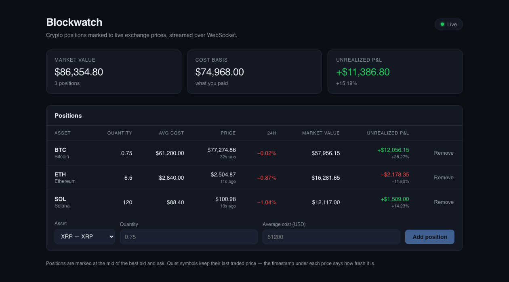

# Blockwatch

A crypto portfolio tracker that marks your positions to live exchange prices. Prices arrive over a
WebSocket connection to Binance, fan out through Redis, and are pushed to the browser — no polling
anywhere in the path.



## Why it is built this way

The interesting problem here is not CRUD, it is keeping many browsers showing the same live feed
without hammering the exchange. One process holds a single upstream connection; every browser is fed
from it.

```
Binance bookTicker WS ──► price-ingestor ──┬── SET price:<SYM>   (last-known cache)
   (1 connection, 5 pairs)                 └── PUBLISH prices    (fan-out)
                                                    │
                                                  Redis
                                                    │  SUBSCRIBE prices
                                                    ▼
                                              api-server  ◄──── Postgres (holdings, via Prisma)
                                            Express + ws
                                                    │  snapshot on connect, then live ticks
                                                    ▼
                                             Next.js dashboard
```

Decisions worth calling out, and the reasoning behind them:

**One upstream connection, many clients.** The ingestor is the only thing talking to the exchange.
Adding browsers costs a Redis subscriber and a socket each, not another exchange connection.

**Redis is both a cache and a bus.** The `PUBLISH` fans ticks out; the `SET` means a browser that
connects between ticks is replayed the last known price immediately instead of staring at an empty
table until something trades. Both happen in one pipelined round trip.

**Valuation maths lives in `shared-types`.** The API values the portfolio on load, then the browser
runs the *same* function on every tick to keep figures moving without refetching. One implementation,
so the two cannot disagree.

**Market value and P&L are never stored.** They are derived from holdings × live price on read, so
there is no persisted figure that can go stale.

**The feed is treated as unreliable, because it is.** The ingestor reconnects with exponential
backoff and force-reconnects if the socket goes quiet; the browser reconnects the same way and keeps
showing last known values meanwhile. Every row displays the age of its last tick, so a quiet symbol
looks quiet rather than broken. Kill the ingestor and the dashboard degrades honestly instead of
emptying out.

**No API key reaches the browser.** Binance public market data needs no credential at all, and the
browser only ever talks to this project's own API.

### Things the exchange dictated

- `stream.binance.com` answers **HTTP 451** to US IPs, so the US endpoints are the default.
  `BINANCE_WS_BASE` / `BINANCE_REST_BASE` switch back; the payloads are identical.
- `@miniTicker` only republishes when its 24h window changes — on a thin book that meant **zero
  messages in 20 seconds**. `@bookTicker` is the live feed instead, and positions are marked at the
  mid of the best bid and ask.
- `bookTicker` carries no 24h open, so the change percentage comes from a once-a-minute REST poll.
  Reference data gets polled; the live price gets streamed.

## Stack

TypeScript end to end — Next.js 15 / React 19, Express 5 with `ws`, Postgres via Prisma, Redis, npm
workspaces, Docker Compose.

## Running it

Everything in containers, one command:

```bash
git clone https://github.com/nchatpolarak1/blockwatch.git
cd blockwatch
docker compose --profile app up --build
```

The API applies migrations on boot. Open <http://localhost:3000>.

For development, run the datastores in Docker and the three services on the host so they reload on
change (requires Node 20+):

```bash
npm install
cp .env.example .env
npm run infra:up      # Postgres + Redis only
npm run db:migrate    # create the schema
npm run db:seed       # a few starter positions (optional)
npm run dev           # ingestor + API + dashboard
```

Redis is published on **6380** rather than 6379 so the project does not collide with a Redis already
running on your machine. Every service falls back to sensible localhost defaults, so `.env` is only
needed to override them.

## Verifying it works

```bash
curl localhost:4000/health
curl localhost:4000/api/portfolio          # server-computed valuation
docker exec blockwatch-redis-1 redis-cli GET price:BTC
docker exec blockwatch-redis-1 redis-cli SUBSCRIBE prices   # watch the fan-out
```

Worth trying in the browser:

- **Refresh the page.** The table is populated immediately from the Redis cache, not blank until the
  next tick.
- **Stop the ingestor** (`npm run dev` keeps running). Prices freeze, the ages start climbing, and
  nothing crashes. Restart it and ticks resume.
- **Stop the API server.** The status pill turns amber and reconnects on its own once it is back, no
  page refresh needed.

## API

| Method   | Path                 | Notes                                                     |
| -------- | -------------------- | --------------------------------------------------------- |
| `GET`    | `/api/portfolio`     | Holdings valued against live prices, with totals           |
| `GET`    | `/api/holdings`      | Raw positions                                              |
| `POST`   | `/api/holdings`      | `409` if the symbol is already held — edit it instead      |
| `PATCH`  | `/api/holdings/:id`  | Update quantity and/or cost basis                          |
| `DELETE` | `/api/holdings/:id`  | `204` on success                                           |
| `WS`     | `/ws`                | `snapshot` on connect, then `tick` messages                |

Symbols outside the watchlist are rejected rather than stored unpriced forever.

## Deliberately not built yet

The MVP stops here on purpose. What is missing and why:

- **A real message bus.** Redis pub/sub is fire-and-forget: a subscriber that is down misses ticks
  and cannot replay them. Kafka or RabbitMQ earns its place once a consumer needs durability or
  replay — an analytics or alerting consumer reading the same stream.
- **Auth.** Everything runs as one demo user. Holdings are already scoped by user id in every query,
  so adding real sessions is a routing concern rather than a rewrite.
- **Historical charts.** Only the latest price per symbol is kept; charts need ticks persisted to a
  time-series store.
- **Price alerts** and an **LLM assistant over the portfolio** — both natural consumers of the tick
  stream once the bus above exists.
- **Deployment.** It runs locally under Docker Compose; nothing is deployed.
